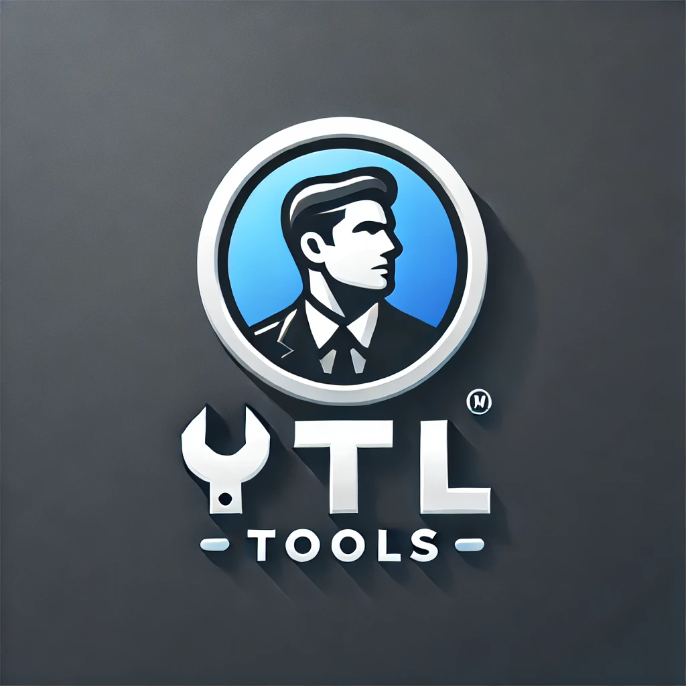

# Util Tools - Ferramentas Online Gratuitas

Util Tools é uma aplicação web desenvolvida em Flask que oferece diversas ferramentas úteis online, como conversão de vídeos do YouTube, extração de áudio, OCR (reconhecimento óptico de caracteres), remoção de fundo de imagens, entre outras funcionalidades.



## Índice

- [Funcionalidades](#funcionalidades)
- [Requisitos](#requisitos)
- [Instalação](#instalação)
- [Uso](#uso)
- [Estrutura do Projeto](#estrutura-do-projeto)
- [Problemas Conhecidos e Limitações](#problemas-conhecidos-e-limitações)
- [Contribuição](#contribuição)
- [Licença](#licença)

## Funcionalidades

- **YouTube Converter (YTC)**: Baixe vídeos do YouTube em formato MP4 ou extraia áudio em MP3.
- **MP4 para MP3**: Converta arquivos de vídeo MP4 para áudio MP3.
- **OCR (Reconhecimento Óptico de Caracteres)**: Extraia texto de imagens.
- **Remoção de Fundo de Imagens**: Remova o fundo de imagens automaticamente.
- **Music Downloader (MDCR)**: Baixe músicas de plataformas como SoundCloud.
- **Instagram Content Downloader (INSCON)**: Baixe conteúdo do Instagram.

## Requisitos

- Python 3.6+
- Flask
- pytube
- moviepy
- yt_dlp
- rembg (opcional - para remoção de fundo)
- pytesseract (opcional - para OCR)
- Tesseract OCR (necessário para o funcionamento do pytesseract)
- onnxruntime

## Instalação

### 1. Clone o repositório

```bash
git clone https://github.com/seu-usuario/util-tools-site.git
cd util-tools-site
```

### 2. Crie um ambiente virtual (recomendado)

```bash
python -m venv venv

# No Windows
venv\Scripts\activate

# No Linux/Mac
source venv/bin/activate
```

### 3. Instale as dependências

```bash
pip install -r requirements.txt
```

### 4. Configuração do Tesseract OCR (para funcionalidade OCR)

#### Windows

1. Baixe o instalador do Tesseract OCR em: https://github.com/UB-Mannheim/tesseract/wiki
2. Instale o Tesseract e anote o caminho de instalação
3. Configure a variável de ambiente `TESSERACT_CMD` com o caminho para o executável do Tesseract

#### Linux

```bash
sudo apt-get update
sudo apt-get install tesseract-ocr
sudo apt-get install tesseract-ocr-por  # Para suporte ao português
```

## Uso

### Executando localmente

```bash
python app.py
```

Acesse a aplicação em: http://localhost:5000

### Usando Docker

```bash
# Construa a imagem
docker build -t util-tools .

# Execute o container
docker run -p 5000:5000 util-tools
```

## Estrutura do Projeto

```
├── app.py                 # Aplicação principal Flask
├── app_simple.py          # Versão simplificada da aplicação
├── app_working.py         # Versão de backup funcional
├── assets/                # Arquivos de mídia
│   └── UtilToolsIcon.webp # Ícone do site
├── Dockerfile             # Configuração para Docker
├── requirements.txt       # Dependências do projeto
├── static/                # Arquivos estáticos
│   └── style.css          # Estilos CSS
├── templates/             # Templates HTML
│   ├── imagermbg.html     # Página de remoção de fundo
│   ├── index.html         # Página inicial
│   ├── inscon.html        # Página do Instagram Downloader
│   ├── mdcr.html          # Página do Music Downloader
│   ├── mptmp.html         # Página de conversão MP4 para MP3
│   ├── ocr.html           # Página de OCR
│   ├── sobre.html         # Página Sobre
│   └── ytc.html           # Página do YouTube Converter
└── test_app.py            # Testes da aplicação
```

## Problemas Conhecidos e Limitações

### Funcionalidade de Remoção de Fundo

A funcionalidade de remoção de fundo (imagermbg) está desativada por padrão devido a problemas de travamento durante a importação da biblioteca `rembg`. Para ativar esta funcionalidade:

1. Modifique o arquivo `app.py` para importar corretamente a biblioteca rembg:

```python
try:
    from rembg import remove as rembg_remove
    REMBG_AVAILABLE = True
    print("rembg: OK", flush=True)
except ImportError as e:
    print(f"rembg not available: {e}", flush=True)
    REMBG_AVAILABLE = False
    rembg_remove = None
```

### Configuração do Tesseract OCR

A funcionalidade OCR requer a instalação correta do Tesseract OCR. Certifique-se de que:

1. O Tesseract está instalado no sistema
2. O caminho para o executável do Tesseract está configurado corretamente
3. Os dados de idioma necessários estão instalados (por exemplo, português)

### Dependências Opcionais

Algumas funcionalidades dependem de bibliotecas específicas:

- OCR: requer `pytesseract` e Tesseract OCR instalado
- Remoção de fundo: requer `rembg`
- Conversão de vídeo: requer `moviepy`
- Download do YouTube: requer `yt_dlp` ou `pytube`

Se alguma dessas bibliotecas não estiver disponível, a funcionalidade correspondente será desativada automaticamente.

## Contribuição

Contribuições são bem-vindas! Sinta-se à vontade para abrir issues ou enviar pull requests.

1. Faça um fork do projeto
2. Crie uma branch para sua feature (`git checkout -b feature/nova-feature`)
3. Faça commit das suas alterações (`git commit -m 'Adiciona nova feature'`)
4. Faça push para a branch (`git push origin feature/nova-feature`)
5. Abra um Pull Request

## Licença

Este projeto está licenciado sob a licença MIT - veja o arquivo [LICENSE](LICENSE) para mais detalhes.